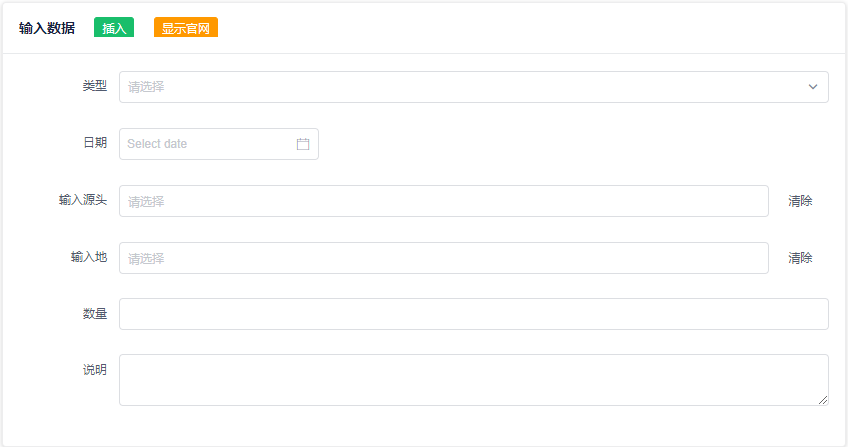
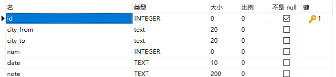
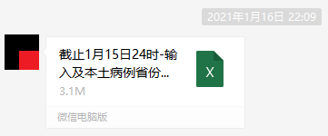
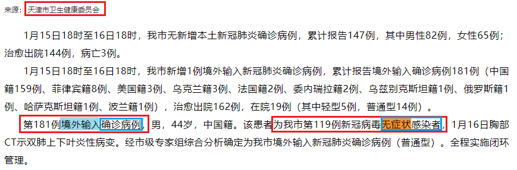
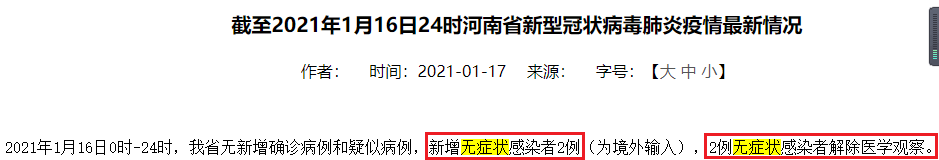
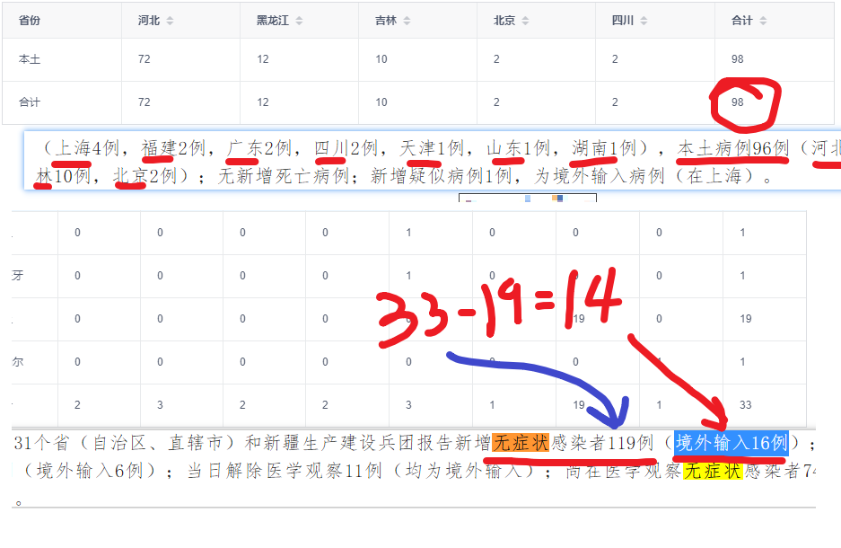
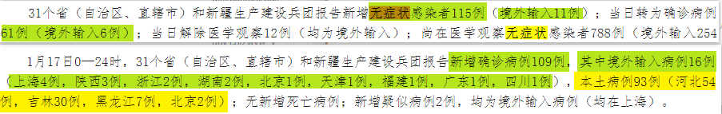
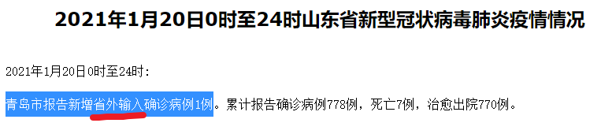
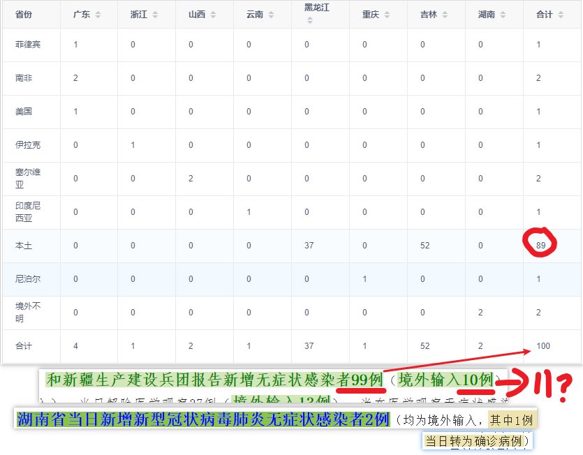
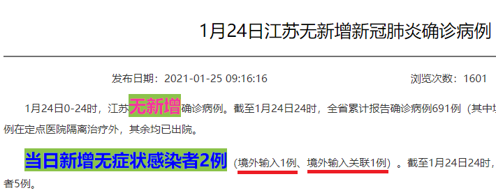

### 项目说明

- 项目是用于规范化输入输出疫情数据而设计

输入数据格式如下



数据库设计如下(懒得设计，每个表格格式尽可能一样即可，差别之处都在文档的最后说明清楚即可)



```sql
CREATE TABLE "main"."Untitled" (
  "id" INTEGER NOT NULL PRIMARY KEY AUTOINCREMENT,
  "city_from" text(20),
  "city_to" text(20),
  "num" INTEGER,
  "date" TEXT(10),
  "note" TEXT(200)
);

INSERT INTO "main"."sqlite_sequence" (name, seq) VALUES ("Untitled", '829');
```

- 项目中的数据来源说明

1. 从起始日期到20210115 之间的数据均来自其他人提供，并在导入时做了修正和一定的调整，例如

> 原数据是 cov19/_pre/截止1月15日24时-输入及本土病例省份及来源.xlsx 文件中的内容，其中在第一天记录中，即2020年9月30日的记录中，同时存在 ```沙特``` 和 ```沙特阿拉伯``` 两个名称，因此无法判定数据是否准确，另外存在 ```土耳其``` 重复名称，因此在重做的数据中并没有这两项重复内容，这里只是强调一下，原文件的统计内容本人没有去核实且错误应该很多。

```sql
① 马拉西亚 -> 马来西亚
② 刚果(金) -> 刚果金
③ 沙特 -> 沙特阿拉伯
④ 本地 -> 本土
⑤ ...（还有一些一时已经忘了）
```



2. 20210116 之后开始的数据均来自全国和各地方的卫生健康委员会，链接可以在 [这里](./views/api/apiIndex.js) 找到

- 类别划定说明

1. 输入无症状感染者转化为确诊，输入输入确诊病例，如果未说明由哪一个国家的无症状转为确诊，视为不明的境外输入，参考如下



2. 看不懂的部分就视为时真实数据不过度理解，不做任何加减乘除，完全执行表面意思，例如下图直接理解为由2例无症状并且有另外的2例接触医学观察



3. 缺少的部分直接做标记为 不明 到 不明，用于和国家卫生健康委员会的数据做校准



4. 当日无症状转确诊数据，两种同时计入？



5. 省外输入视为本土？



6. 冲突数据，特别是当前转换情况的按国家发布为准，例如湖南报告为无症状新增两例，记录为无症状新增1例。



7. 如果有强调境外输入几例剩下就是本土，如下图，境外1例，本土1例

